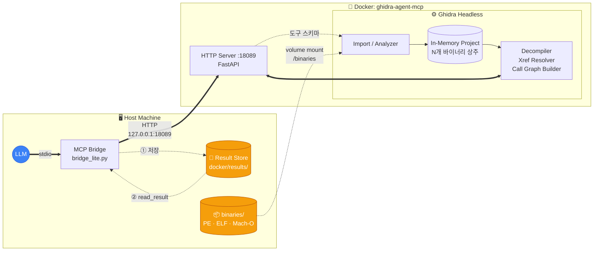

## 왜 이게 필요한가

리버싱에서 제일 답답한 순간은 "이 함수가 어느 DLL로 넘어가서 뭘 호출하는지" 따라가야 할 때다. Ghidra GUI에서 xref·callgraph 따라가며 탭 스위칭 수십 번. 바이너리가 9개쯤 섞여 있으면 머릿속에서 실이 엉킨다.

LLM에 맡기려고 해도 걸림돌이 있다.

- **바이너리 하나당 한 세션**: 기존 Ghidra MCP들은 한 번에 한 프로그램만 분석. DLL 경계 넘는 추적이 안 됨
- **함수 호출 체인이 데이터가 아님**: `WriteFile` 이 어디서 import되고 어디서 불리는지는 xref 그래프 자체를 쿼리할 수 있어야 함
- **사람 대신 그래프를 걷는 기능**이 필요

그래서 **9개 프로그램을 동시에 메모리에 띄워놓고, 의존성·xref·콜그래프를 전부 도구로 노출** 하는 Ghidra MCP를 만들었다.

---

## 핵심 기능 — 바이너리 경계를 넘는 탐색

```plaintext
 [notepad.exe]     [user32.dll]    [kernel32.dll]    [gdi32.dll]
   imports ──────▶  exports           imports ──────▶  exports
      │               │                  │
      └─ deps_cross_xref("WriteFile") ───▶ 전 프로그램에서 이 심볼을 쓰는 곳 전부
      └─ deps_trace("RegSetKeyValueW") ──▶ import 체인 추적
      └─ callgraph_path(start, end) ─────▶ BFS로 두 함수 사이 최단 경로
```

대표 도구 몇 개:

| 도구 | 하는 일 |
|------|--------|
| `deps_list` / `deps_tree` | 프로그램의 라이브러리 의존 목록과 재귀 트리 |
| `deps_match(A, B)` | A의 import가 B의 export에 매칭되는지 |
| `deps_cross_xref(fn)` | **로드된 모든 프로그램에서** 특정 함수를 import/call 하는 지점 전부 |
| `deps_trace(fn)` | import 체인 따라가며 실제 구현 위치 찾기 |
| `deps_unresolved` | 로드된 DLL 어디에도 정의 안 된 심볼 수집 (다음 로딩 힌트) |
| `callgraph_full` / `callgraph_path` | 프로그램 내부 전체 콜그래프, 또는 두 점 사이 최단 경로 |
| `function_callers` / `function_callees` | 단일 함수 기준 xref 상·하행 |
| `decompile` | C 의사코드 덤프 (단일 함수) |

**크로스 바이너리** 기능이 포인트다. LLM은 "이 심볼이 notepad.exe import 목록에 있네 → kernel32.dll export에서 찾고 → 그 함수 디컴파일" 을 한 세션 안에서 연결할 수 있다.

### 아키텍처 구성도



**Host 쪽**
- **LLM** — `bridge_lite.py` 를 stdio 서브프로세스로 실행
- **MCP Bridge** — LLM의 도구 호출을 HTTP로 번역해 컨테이너에 넘기고, 응답을 크기 기준으로 라우팅 (본문 or summary+path)
- **Result Store** — 모든 응답을 JSON으로 항상 저장. `read_result()` 로 재조회 가능
- **binaries/** — 분석할 바이너리가 놓이는 볼륨. 컨테이너 내부에서 `/binaries` 로 마운트

**Docker 컨테이너 쪽 (Ghidra headless)**
- **HTTP Server :18089** — 내부 포트로 MCP Bridge의 요청만 받음
- **Import / Analyzer** — 바이너리 올라오면 자동 분석 → In-Memory Project 에 로드
- **In-Memory Project** — 여러 프로그램이 **한 프로젝트에 동시 상주**. 크로스 바이너리 쿼리의 전제
- **Decompiler / Xref Resolver / Call Graph Builder** — HTTP 엔드포인트별로 Ghidra 내부 엔진 호출

컨테이너는 **외부에 포트를 노출하지 않고** host loopback으로만 통신. GUI는 없음 (headless) — 모든 상호작용이 HTTP API로만.

---

## 분석 예제: notepad.exe + 주요 DLL 9개

지금 컨테이너에 올린 실제 구성:

| 바이너리 | 함수 수 |
|---------|--------|
| notepad.exe | 853 |
| gdi32.dll | 1,989 |
| msvcrt.dll | 2,148 |
| comctl32.dll | 2,075 |
| advapi32.dll | 2,562 |
| kernel32.dll | 3,920 |
| comdlg32.dll | 4,302 |
| user32.dll | 4,203 |
| shell32.dll | (분석 완료) |
| **합계** | **약 22,000+** |

9개 프로그램이 전부 Ghidra 프로젝트 내에 상주 상태. `deps_cross_xref` 같은 크로스 쿼리가 이 9개 모두를 대상으로 동시에 돈다.

---

## 실제 탐색 예시

> **Q. "메모장이 파일을 저장할 때 어떤 경로로 디스크에 쓰는지 추적해줘"**

LLM이 도구만 써서 답에 도달한 과정.

**① 파일 I/O 관련 import 식별**

```plaintext
imports(program="notepad.exe")  (필터: File/Write)
→ API-MS-WIN-CORE-FILE-L1-1-0.DLL
    CreateFileW, ReadFile, WriteFile, SetEndOfFile, DeleteFileW, ...
→ COMDLG32.DLL
    GetSaveFileNameW, GetOpenFileNameW, GetFileTitleW
```

저장 다이얼로그(comdlg32) + 실제 쓰기(kernel32 계열) 두 축이 보임.

**② 크로스 바이너리 xref — WriteFile 사용자**

```plaintext
deps_cross_xref(function="WriteFile")
→ notepad.exe   @ API-MS-WIN-CORE-FILE-L1-1-0.DLL (6곳)
  advapi32.dll  @ KERNEL32.DLL                     (5곳, 직결)
  msvcrt.dll    @ API-MS-WIN-CORE-FILE-L1-1-0.DLL (7곳)
  shell32.dll   @ API-MS-WIN-CORE-FILE-L1-1-0.DLL (11곳)
```

같은 `WriteFile` 인데 notepad·msvcrt·shell32는 **API-MS-WIN-\* 가상 DLL로 우회**, advapi32는 KERNEL32로 **직접 import**.

**③ 저장 다이얼로그 진입점**

```plaintext
deps_cross_xref(function="GetSaveFileNameW")
→ notepad.exe 단독, 1회 호출 @ 0x14000d44d

function_callers(0x14000d44d, notepad.exe)
→ FUN_14000da6c
```

다이얼로그를 여는 함수는 `FUN_14000da6c` 하나로 확정.

**④ WriteFile 호출자들을 일괄 추적**

```plaintext
function_callers(WriteFile 사이트 6개, notepad.exe)
→ 호출자가 4개 함수로 수렴:
    FUN_14000c510   (2곳에서 중복 호출)
    FUN_140022594
    FUN_14000da6c   ← ③과 동일!
    FUN_140011ae8
```

**핵심 발견**: `FUN_14000da6c` 가 `GetSaveFileNameW` **와** `WriteFile` 을 **둘 다** 호출한다.

**⑤ 각 함수 시그니처**

```plaintext
function(0x14000da6c, notepad.exe)
→ WCHAR * FUN_14000da6c(HWND, ushort, ...),  size 3523
  (다이얼로그 핸들 받고 파일명 반환 — Save As 본체)

function(0x14000c510, notepad.exe)
→ bool FUN_14000c510(void),                  size 713
  (작은 bool 반환 — 쓰기 완료 플래그)

function(0x140011ae8, notepad.exe)
→ undefined8 FUN_140011ae8(..., undefined2 *),  size 2054
  (넓은 포인터 인자 — 인코딩 변환 래퍼 추정)

function(0x140022594, notepad.exe)
→ undefined8 FUN_140022594(longlong),        size 1084
  (단일 핸들 인자 — 자동 저장/백업 추정)
```

**⑥ Save As 함수 내부 호출 열거**

```plaintext
function_callees(0x14000da6c, notepad.exe)
→ SetThreadDpiAwarenessContext, CommDlgExtendedError, MessageBoxW,
  CoTaskMemFree, memset, _guard_dispatch_icall,
  FUN_140011ae8 (2회 — 인코딩 변환),
  FUN_14000c510 (마지막 쓰기),
  ...
```

다이얼로그 표시 → 오류 처리 → **FUN_140011ae8 (인코딩 변환)** → **FUN_14000c510 (실제 쓰기)** → COM 메모리 해제 순.

---

> **A. 메모장의 파일 저장 경로**
>
> ```plaintext
> [User: Ctrl+S / Save As]
>         │
>         ▼
>   FUN_14000da6c  (3,523 bytes, Save As 본체)
>   ├── GetSaveFileNameW  ──▶ comdlg32.dll  (사용자에게 경로 선택 UI)
>   ├── CommDlgExtendedError, MessageBoxW   (오류 처리)
>   ├── FUN_140011ae8  (2,054 bytes, 인코딩 변환 래퍼)
>   │     └── WriteFile  (BOM/UTF-16/ANSI 처리된 스트림)
>   ├── FUN_14000c510  (713 bytes, 쓰기 완료 플래그 반환)
>   │     └── WriteFile
>   └── CoTaskMemFree  (다이얼로그 메모리 정리)
> ```
>
> **핵심 관찰**
> - 메모장은 `WriteFile` 을 **API-MS-WIN-CORE-FILE-L1-1-0.DLL** 경유해서 import (가상 DLL → kernel32 포워딩). advapi32는 KERNEL32.DLL 직결로 5곳에서 씀 — **모듈별 로더 정책이 다름**
> - 저장 로직이 **한 함수(FUN_14000da6c)** 에 몰려 있고 그 안에서 인코딩 변환(FUN_140011ae8)과 버퍼 쓰기(FUN_14000c510)가 **분리**되어 있음. ANSI/UTF-8/UTF-16 BOM 처리를 별도로 둔 구조
> - `FUN_140022594` 는 WriteFile 쓰지만 Save As 경로에 없음 → **자동 저장/백업 경로**일 가능성 높음 (추가 추적 대상)
> - 같은 `WriteFile` 인데 9개 프로그램 중 **advapi32만 KERNEL32 직결, 나머지 4개는 API-MS-WIN-\* 가상 DLL 경유** — Windows의 API Set 메커니즘이 바이너리별로 다르게 적용돼 있는 증거

사람이 중간에 주소를 메모하거나 프로그램을 전환할 필요가 없다. ②의 **크로스 바이너리 xref**, ④의 **일괄 caller 수집**, ⑥의 **내부 callees 열거** 가 모두 도구 호출 한 줄씩 — Ghidra GUI였다면 9개 프로그램 사이 xref 더블클릭 + 함수 시그니처 확인 + 콜 그래프 추적을 수십 번 반복해야 하는 분량이다.

---

## 토큰 문제 해결책

이 도구로 탐색을 제대로 하려면 `imports()`, `callgraph_full()`, `exports()` 같은 대형 리스트 호출이 불가피하다. 그런데 kernel32.dll 하나의 `imports()` 응답만 60KB, `callgraph_full()` 은 80KB 이상. 한 세션에 10여 번 호출하면 수십만 토큰이 맥락에 쌓인다.

여기서부터 [이전 글에서 소개한 QMD](/post/development/qmd_mcp_windows)가 등장한다.

---

## QMD 결합으로 토큰 문제 해결

Ghidra MCP는 모든 응답을 디스크에도 저장한다 (`docker/results/*.json`).

### 1단계: path-return만으로 절감

12개 시나리오를 실측했다. `return_context=true` (원본 전부 반환) vs 기본 (path) 비교.

| 작업 | path 모드 | 원본 | 절감 |
|------|----------|------|------|
| imports (notepad) | 475 | 15,556 | 33배 |
| deps_summary (notepad) | 389 | 10,124 | 26배 |
| imports (kernel32) | 489 | 60,511 | **124배** |
| deps_tree 재귀 (notepad) | 356 | 46,553 | **131배** |
| exports 5,000 (user32) | 466 | 121,376 | **261배** |
| callgraph_full (각 DLL) | ~317 | ~83,000 | **261–271배** |
| deps_unresolved (9개 전부) | 417 | 261,984 | **628배** |
| strings 5,000 (shell32) | 683 | 574,315 | **841배** |

**누적 (12개 시나리오 합산)**

| | 문자 수 | 추정 토큰 |
|---|--------|---------|
| path 모드 | 4,990 | ≈ 1,247 |
| 원본 반환 시 | 1,429,277 | ≈ 357,319 |
| **비율** | | **286배 절감** |

### 2단계: 쌓인 JSON을 QMD로 의미 검색

이 시점에 `docker/results/` 에 74개 JSON이 쌓였다. 경로 목록만 들고 있는 LLM은 "어디에 뭐가 있는지" 모른다. QMD 컬렉션으로 등록하면 끝:

```yaml
# ~/.config/qmd/index.yml
collections:
  ghidra-results:
    path: C:/Users/USER/Desktop/ghidra-agent-mcp/docker/results
    pattern: "**/*.json"
```

자연어로 "레지스트리 접근 함수" 질의:

```json
query: "registry access or manipulation functions"

→ 1위: notepad-exe/imports-*.json
       "library": "API-MS-WIN-CORE-REGISTRY-L1-1-1.DLL"
       "functions": ["RegSetKeyValueW"]

→ 2위: kernel32-dll/imports-*.json  (score 0.88)
```

`RegSetKeyValueW` 라는 심볼명을 **모르는 상태에서** 해당 JSON을 집어냈다. 응답 크기 약 2.6KB.

### 전체 파이프라인 토큰 프로파일

| 단계 | 무엇을 함 | 토큰 |
|-----|---------|-----|
| ① Ghidra MCP 호출 12회 | path-return으로 요약만 받음 | ≈ 1.2k |
| ② QMD 의미 검색 | 관련 JSON 5개 랭킹 | ≈ 0.6k |
| ③ `read_result()` 로 진짜 필요한 1개만 열람 | 필터된 섹션 | ≈ 2k |

**총합 약 4k 토큰** — 원본 덤프 방식이면 35만 토큰이 필요한 같은 결론을, **1% 수준**에서 도달한다.

---

## 정리

- **Ghidra MCP** — 9개 프로그램 동시 상주, `deps_cross_xref` · `callgraph_path` 등 크로스 바이너리 탐색 도구 제공. LLM이 GUI 없이 의존성·xref를 혼자 걷게 한다
- **QMD 결합** — 쌓인 분석 결과를 자연어로 재검색. 심볼명 몰라도 찾아짐
- **토큰**: path-return 286배 + 의미 검색 조합으로 전체 파이프라인 **1% 수준**으로 감소

대규모 바이너리 분석을 LLM이 주도하게 하려면, 단순히 Ghidra를 도구화하는 것 이상으로 **저장·검색 계층**까지 묶어야 한다. 두 MCP가 파일 시스템을 매개로 붙는 구조가 그 답이다.

> 도구 구현은 [BobongKu/ghidra-agent-mcp](https://github.com/BobongKu/ghidra-agent-mcp) 에 공개되어 있고, QMD 세팅은 [이전 글](/post/development/qmd_mcp_windows)에서 다뤘다.
